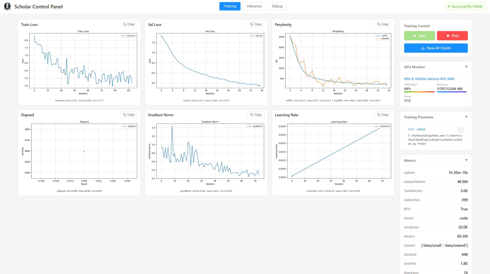
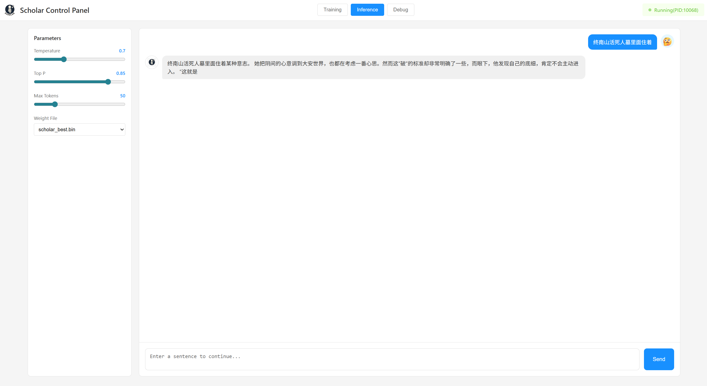
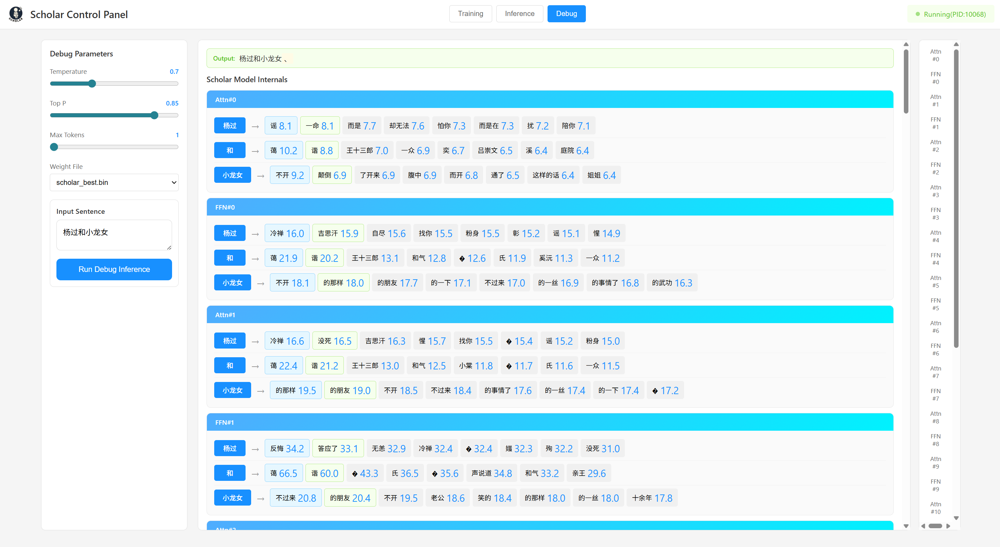

<div  align="center">


**Scholar Etude** - Modernized minimal GPT implementation from scratch.
</div>

----

**Scholar Commands**

Install dependencies
```
$ pip install -r requirements.txt
```

Pre-training the model
```
$ git clone --branch master https://huggingface.co/datasets/y1yang0/scholar-novels-curated data
$ hf download y1yang0/scholar-novels-curated --repo-type=dataset --local-dir ./data --revision master # or you prefer hf tool
$ python scholar/scholar.py train
```

Generating next few words
```
$ python scholar/scholar.py predict
```

Inspecting model internals
```
$ python scholar/scholar.py debug
```

---

**Scholar Dashboard**

Use `python scholar/dashboard.py` to run dashboard



