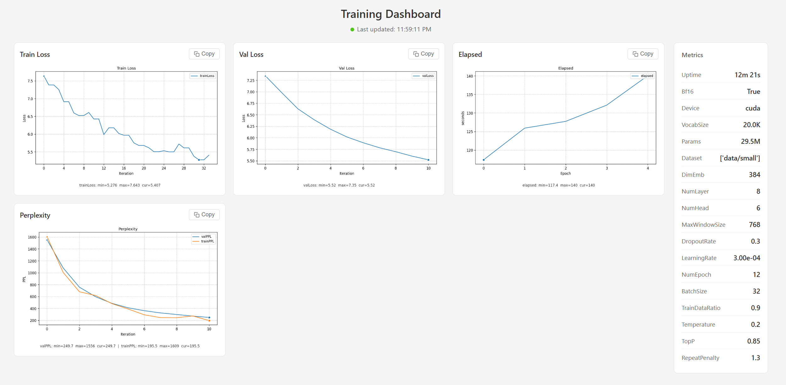

<div  align="center">


**Scholar Etude** - Modernized minimal GPT implementation from scratch.
</div>

----

**Install dependencies**: 
```
$ pip install -r scholar/requirements.txt
```

**Pre-training the model**:
```
$ git clone --branch master https://huggingface.co/datasets/y1yang0/scholar-novels-curated data
$ python scholar/scholar.py train
```

**Generating next few words**:
```
$ python scholar/scholar.py predict
```

**Inspecting model internals**:
```
$ python scholar/scholar.py debug
```

## Training dashboard
Running `python misc/draw.py` to run traning monitor


